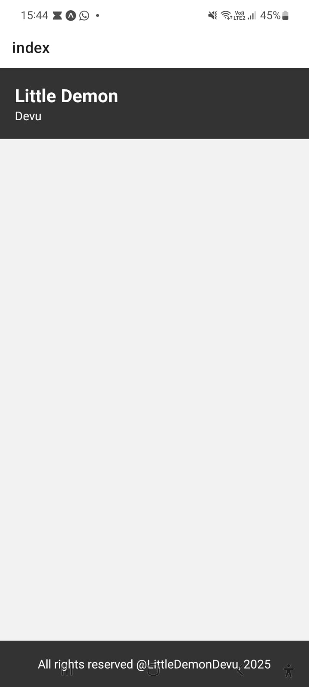
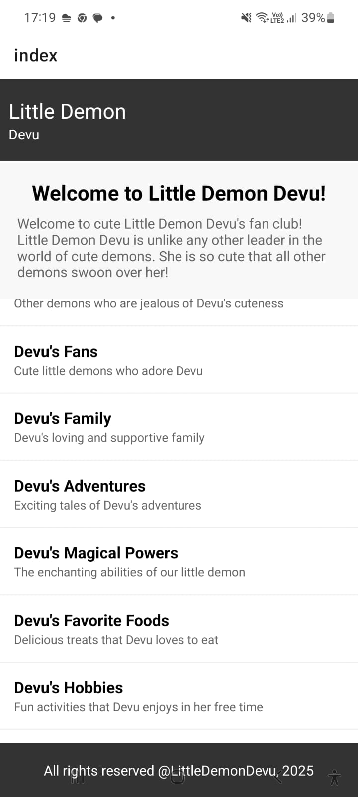

https://www.coursera.org/learn/react-native-course/lecture/uQtOg/react-native-development-environment-overview

# Module 1
npx create-expo-app coursera

cd coursera | npm start

structure of react native code

you can use snacl.reactnavtiev.dev

Expo adds a layer of abstaction, doesnot allow to touch the abstractiona api.

React native consists
of core components

community component

library component

native components

npm run reset-project

# post module one submission you are hit by a paywall

