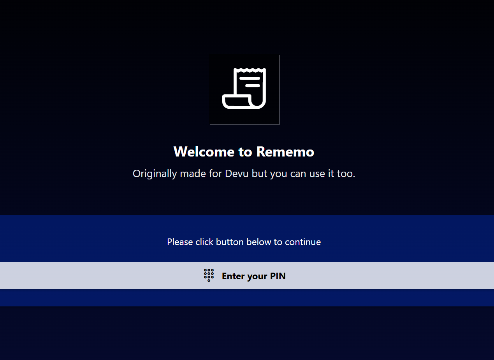
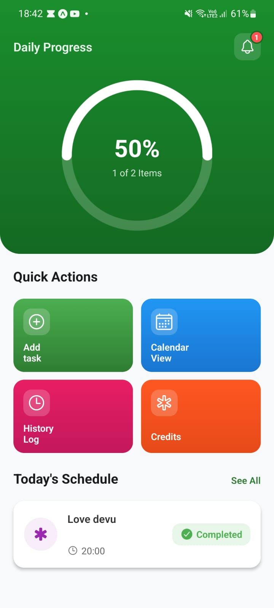

# color schemes

Primary: #000000 (Deep Indigo)
Secondary: #050a30 (Muted Dark Blue)
Highlight: #7077A1 (Soft Blue-Grey)
Accent: #CC9966 (Warm Copper/Muted Orange) - For warmth and contrast

## issues

1. push notifications to be changed
2. revamp the app compleetely
3. no project id in manifest error

Things I dont know , how the layout thing works